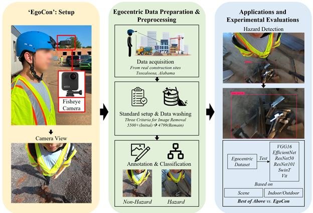
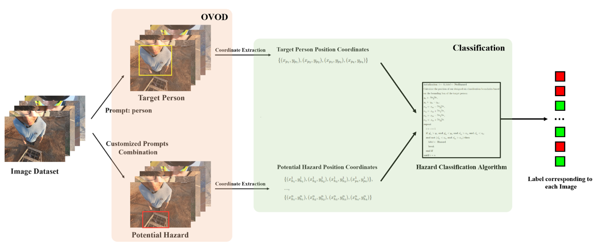

# Detecting without Training: An Open-vocabulary Object Detection Method for Identifying Hazardous Objects on the Construction Site
# Our contribution
•	The creation of the first dataset focused on egocentric views of construction site hazards, comprising over 5,000 images from various construction sites in both indoor and outdoor environments. This dataset serves as a significant resource for future research in construction safety.
•	An innovative OVOD-based construction hazard detection and classification method that avoids time-consuming training processes while showing exceptional robustness and a solid ability to generalize.
•	Extensive experiments have been conducted to evaluate the proposed system and compared with existing popular classification networks in various settings. These experiments validate the high quality and diversity of the dataset and the proposed system’s superior performance.

# Workflow
Our comprehensive system is structured into three main sections to address the challenge of identifying construction hazards on sites: 'EgoCon' system setup, data preparation and preprocessing, and experimental evaluations. The process begins with the hardware setup, where wide-angle cameras are mounted on safety helmets to collect data from various construction sites. The collected data is then filtered and manually annotated depending on whether it contains construction hazards. The final stage involves testing the system's effectiveness and assessing its usability by comparing its performance with existing deep-learning networks. Each of these stages will be explained in detail in the subsequent sections.

  

# Hazard Classification
Despite corrections made through camera calibration, the use of wide-angle cameras still introduces a degree of distortion to our datasets. Moreover, compared with 3D data, 2D images lose their spatial features, making it impossible for us to directly classify construction hazards with the position of those hazard objects based on plane graphic standards. Therefore, the image can be regarded as a plane rectangular coordinate system. Figure 7 shows the workflow of hazard classification where the person and hazardous objects were obtained by OVOD methods along with their corresponding position coordinates. After applying the designed classification algorithm, a picture is finished with the labeling process. Based on the position of the detected bounding box of the target person, we can obtain the designed six classification position baselines. Figure 8 shows the details of these baselines. By comparing the relative position among the boundaries and the potential hazard object, we can classify the hazard objects in the image as positive or negative. Given a detected potential hazard object in the image, similar to the target person, we can get the position of the corresponding bounding box’s four vertices. Although it is possible that multiple hazardous objects exist in an image, as long as there exists a positive hazard object, the image will be marked as Hazard.

  

  

# Dataset
Initially, the researchers collected more than 5500 images and manually removed those invalid images, following the above standards, resulting in a final collection of 4799 images. The dataset was categorized into two groups: ‘Hazard’ and ‘Non-hazard,’ in which 1652 images were labeled as ‘Hazards’ and 3147 images were labeled as ‘Non-hazards’. The dataset was also categorized into indoor and outdoor based on the environment, which contained a collection of 1610 indoor images and 3189 outdoor images. The source dataset comprised images captured directly with a wide-angle camera, while the correction dataset included these source images after performing camera calibration to correct distortions. From the comparative experiments on the source dataset and correction dataset, the authors found that camera calibration can significantly improve the performance of the proposed system. To compare the models’ performance in different settings, we extended the two datasets to four datasets: The source dataset categorized by scene (Source Scene), the correction dataset categorized by scene (Correction Scene), the source dataset categorized by indoor/outdoor, and correction dataset categorized by indoor/outdoor. In Source Scene and Correction Scene, the images have been systematically categorized according to the various sites from which they were sourced.

  

  

# Fine-tuning Deep Learning Networks
## Scene datasets with/without data augmentation

  

## Indoor/outdoor datasets with/without data augmentation

  

# The contrast between the best fine-tuned Deep Learning Networks and the proposed Ground-dino-based system on our four datasets

  

# Conclusion
This study proposed the EgoCon system that integrates a lightweight wide-angle camera mounted to a hardhat from an egocentric perspective to identify construction hazards. We collected datasets specifically for detecting hazards on construction sites with the EgoCon setup. This dataset serves as a reliable foundation for testing OVOD methods. A series set of experiments was conducted to investigate both the datasets and the EgoCon system’s usability. Weighted F1-Score was selected as the evaluation matric. The results of the experiment indicated that not only the self-created egocentric view datasets can be useful in construction hazard classification, but also the EgoCon system outperforms traditional deep-learning networks in nearly all settings of construction hazard classification. Previous studies in construction hazard detection have consistently encountered challenges such as cost inefficiency and poor performance. In this paper, we introduce a system based on the OVOD method to solve construction hazard classification tasks within construction site environments and present a new benchmark that has been proven its high quality and diversity by our experiments. While the selection of OVOD prompt and hyper-parameters in the system requires experimental tuning to achieve optimal performance, our system has presented remarkable robustness and strong generalization ability across various experiments. All the experiment results have supported our hypothesis. Although our framework outperforms all other fine-tuned models, a review of the classified images revealed that the OVOD model might produce accurate classification outcomes while having false detection. For instance, OVOD might miss detecting wires or mistakenly identify wires as wood slots but precisely identify a metal bar which qualifies the criteria, leading to an accurate classification outcome. We believe that construction hazard detection is a promising research area within the field of civil engineering, which is closely related to safety awareness. By releasing our benchmark and introducing an OVOD-based system, we aim to inspire more research work, such as material recovery and broader hazard detection tasks on the construction site.
